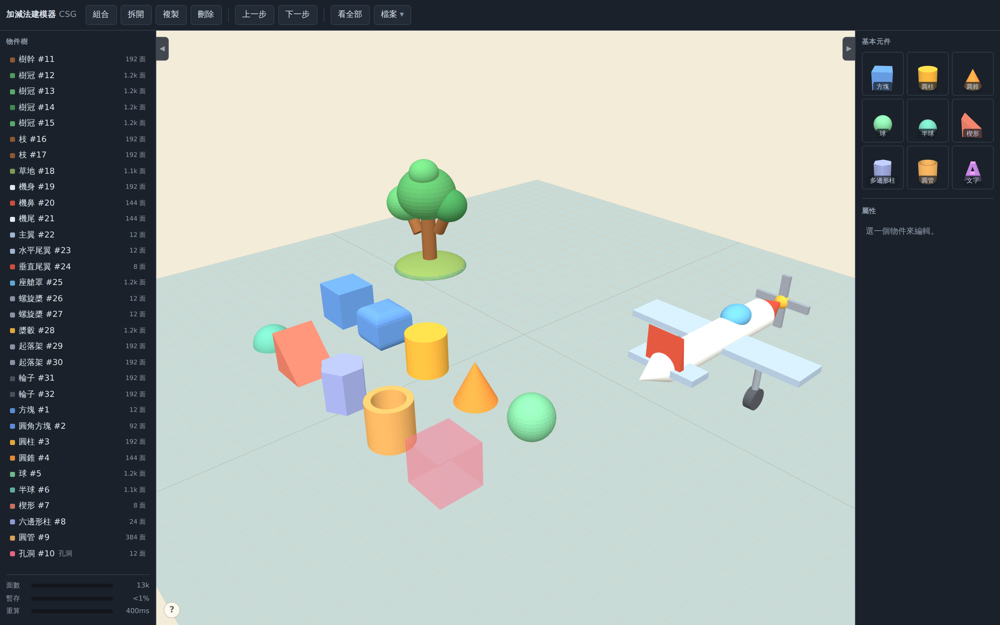
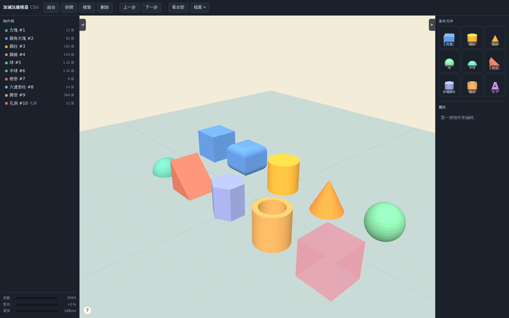

# 加減法建模器

一個用「實體 ＋ 孔洞」邏輯做 3D 建模的工具。單一 HTML 檔案，開啟即用，不需安裝、不需帳號、不需網路。

上面這一張是實際的操作畫面：左邊那棵樹和右邊那架飛機，都是純粹用內建積木擺出來的，
沒有匯入任何外部模型；中間那一排是全部十種積木。
場景檔在 [`docs/examples/hero.json`](docs/examples/hero.json)，用「檔案 ▾ → 開啟」讀進來就能自己拆開看、改參數。

積木有方塊、圓角方塊、圓柱、圓錐、球、半球、楔形、多邊形柱、圓管，以及文字；
紅色半透明的那一個是「孔洞」，跟實體組合起來就是挖掉的部分。

適合快速做外殼、墊片、治具這類以幾何組合為主的東西，做完直接匯出 STL 去 3D 列印，
或匯出剖面 SVG 去雷射切割。

## 直接使用

**線上版**：把這個 repo 的 GitHub Pages 網址打開即可。

**離線版**：下載 `index.html`，雙擊開啟。整個軟體就是這一個檔案，複製到隨身碟帶著走也能用。

## 設計概念

核心只有兩種角色：

- **實體（Solid）** — 加法
- **孔洞（Hole）** — 減法

把幾個物件選起來按「組合」，同一組裡的孔洞就會從實體上被挖掉。這套邏輯叫 CSG（Constructive Solid Geometry，構造實體幾何）。

關鍵在於**組合是可逆的**。挖出來的結果並沒有把原料吃掉，原始的方塊和圓柱仍然完整保存在物件樹裡，隨時可以「拆開」還原，參數也都還在。左側的物件樹會把這個結構直接顯示出來。

存檔存的也是這棵樹，不是三角形。檔案只有幾 KB，而且是人看得懂的 JSON，想改尺寸只要改數字。

## 功能

**元件**（右側選單，每一格都是會轉的 3D 縮圖，看到什麼點下去就得到什麼）
- 方塊（可以直接加圓角，不必換成另一種形狀）、圓柱、圓錐、球、半球、楔形、
  正 N 邊形柱（3～24 邊，六角柱就是 N=6）、圓管（可調壁厚）
- **文字**：打字就變成立體的字，用你電腦上裝的字型，中文沒問題。
  做出來跟其他元件一樣，可以改成孔洞刻進外殼裡
- 實體／孔洞切換
- 組合／拆開（可逆，可多層巢狀）

**操作**
- 拖曳移動，1mm 網格吸附
- 四角 ＋ 四邊中點縮放把手，拉哪邊對面就固定不動
- 三軸旋轉環，吸附 15°
- 拖曳時即時顯示尺寸與角度
- 框選（空白處拖，Shift 加選；框沿著視角無限延伸，遠近與遮擋都不影響）
- 九向對齊、三軸鏡像——**滑鼠移到按鈕上會先浮出半透明的「鬼影」**，
  按下去之前就看得到結果
- `Ctrl` + `D` 連續複製：複製一份、拖到定位、再按就照同樣的距離一直排下去
- 表面吸附：按住 `Ctrl` 拖曳，物件會坐到它下面那個東西的表面上
- 拖到一半後悔了按 `Esc` 就取消，東西回到動之前的位置
- 刪除、上一步／下一步
- 左右兩側的面板都可以收起來，把畫面讓給模型

**檔案**（都收在工具列的「檔案」選單裡）
- JSON 存檔／開啟——存的是那棵樹，檔案小、可以事後改參數
- 插入元件：把另一個存檔整棵樹當成一個組合放進來
- 匯入 STL：當成可加減的元件（目前上限 100000 面，見下方說明）
- 匯入 SVG：平面圖形擠出厚度變成立體，可當實體也可當孔洞
- 匯出 STL（Z 軸朝上，符合 3D 列印慣例）／匯出 OBJ（保留物件分組）
- 匯出 SVG：**取模型與工作平面相交的那一層剖面**，給雷射切割用。
  想切哪一層就把模型上下移動去碰工作平面（畫面上那層藍色玻璃就是它）
- 匯出範圍看選取：有選就只匯出選的，沒選才是全部
- 自動暫存：關掉瀏覽器再開會接續上次

**物件樹下方的油表**

即時顯示三個數字，綠→黃→紅：

- **面數** — 目前模型的三角形總數，也是運算成本的來源
- **暫存** — 自動暫存用掉多少空間（上限約 5MB，滿了會提醒你手動存檔）
- **重算** — 上次重新計算花了多久

超過八成會跳警告字。如果看到「有物件算不出來」，代表布林運算撐不住了，那個
物件會暫時消失——通常是面數太高造成的。

物件樹上每個東西也都標了自己的面數，一眼看得出是誰把場面撐重的。

**算很久的時候畫面不會死掉。** 布林運算是切成一小段一小段跑的，算的時候還可以
轉視角、也可以按「取消」回到上一次的結果。沒被動到的東西不會重算，所以移動
一個東西不會拖累旁邊那個很重的組合。

## 操作方式

| 動作 | 操作 |
|---|---|
| 移動物件 | 拖曳物件本體 |
| 調整離地高度 | 拖曳上方黃色錐體 |
| 等比縮放 | 拖曳底面四角深色方塊（按住 Shift 連高度一起） |
| 單軸縮放 | 拖曳底面四邊中點 |
| 只改高度 | 拖曳頂部藍色方塊 |
| 旋轉 | 拖曳彩色圓環（Shift 切換成 1° 微調） |
| 框選 | 空白處拖曳（Shift 加選） |
| 讓物件坐到下面那個東西上 | 按住 `Ctrl` 拖曳物件 |
| 轉視角 | 右鍵拖曳，或按住 Alt ＋ Shift 移動滑鼠 |
| 平移視角 | 中鍵拖曳、Alt ＋ 左鍵拖曳，或按住 Alt 移動滑鼠 |
| 遠近 | 滾輪，或觸控板兩指滑動／捏合 |
| 多選 | Shift ＋ 點選 |
| 貼齊工作平面 | 選取後按右側面板的「貼齊工作平面」 |
| 鏡像 | 選取後按右側面板的「左右／上下／前後」 |

**筆電觸控板**：按住 `Alt` 直接移動就是平移，加按 `Shift` 就是轉視角，
兩個都不必按住板子。有滑鼠的人原本的操作全部保留。

**快速鍵**

| 按鍵 | 功能 |
|---|---|
| `H` | 實體／孔洞切換 |
| `Ctrl` + `G` | 組合 |
| `Ctrl` + `Shift` + `G` | 拆開 |
| `Esc` | 拖到一半取消這次動作（移動、縮放、旋轉、框選都可以） |
| `Ctrl` + `D` | 複製（拖到定位後再按，會照同樣的距離一直排下去） |
| `Ctrl` + `Z` | 上一步 |
| `Ctrl` + `Shift` + `Z` | 下一步 |
| `Delete` 或 `Backspace` | 刪除 |

## 會踩到的地方

這幾件事不是壞掉，是這個工具目前的性格，先知道會少走冤枉路。

**轉斜的物件，拉單邊會照畫面的方向變形。** 把手永遠照畫面的上下左右擺，你拉哪
一邊就往那一邊變形，不管物件轉幾度。代價是這個變形黏在畫面方向上——**先斜拉、
再去轉那個物件，形狀會跟著歪掉**。建議先轉到要的角度，再拉變形。轉正的物件
（0/90/180/270 度）沒有這個問題，尺寸維持精確的 mm。

**匯入的 STL 上限是 100000 面。** 這個數字刻意開得很寬——軟體不幫你決定
「太慢」，值不值得等由你自己判斷。但要有心理準備：

- 五千面以下：順，跟方塊圓柱差不多
- 五千到兩萬面：每次放開滑鼠會頓幾秒
- 兩萬面以上：**一次重算可能要好幾分鐘，而且算的時候畫面完全沒反應**——
  不能轉視角、不能按取消，看起來像當掉了，其實它在算。請耐心等，不要一直點。
  實測 4 萬面 79 秒、5 萬 7 千面 3 分鐘，接近十萬面時可能要等十幾分鐘，
  也有機會因為記憶體不夠被瀏覽器直接關掉分頁。
- 超過十萬面：直接擋掉

匯入很重的模型時軟體會先問你一聲，兩萬面以上會用更重的話再問一次。
另外**很大的模型自動暫存存不下**（瀏覽器只給約 5MB），油表會亮
「暫存已滿，請手動存檔！」，這時候一定要自己按存檔，關掉就救不回來了。

**匯出不會自動幫你做組合。** 沒有組合起來的東西就是各自獨立的：最上層的實體
各出各的，最上層的孔洞**不會**自動去挖別人。想讓孔洞生效，就先把它跟實體
組合起來。這樣「畫面上長什麼樣，匯出就是什麼樣」。

**文字用的是你電腦上裝的字型，沒裝的會被瀏覽器悄悄換掉。** 所以小視窗裡有
即時預覽，看到的就是會刻出來的樣子。另外刻凹字建議勾「粗體」——細筆畫的字
（尤其中文）列印或雷切時容易斷掉或糊在一起。字的輪廓是描出來的，放很大看
邊緣會有一點點鋸齒，刻 3～10mm 的字看不出來。

**會變慢的是「算」，不是「用」。** 每次移動、縮放放開滑鼠都要重算一次布林
運算，那是要等的地方；算完之後畫面照樣順，因為畫圖是顯示卡的事——場上
三十幾萬個三角形它也不當一回事。

所以油表三根裡面，**「重算」那根才是真正該看的**：它就是你每動一下要等的
秒數。面數高不一定慢（各自獨立擺著的東西不用算），面數低也可能慢（兩個
高面數的東西互相挖）。

## 尚未實作

可移動的工作平面、尺標、貼到斜面（現在的表面吸附只會讓物件坐上去，
不會跟著斜面轉向）。

**不會做陣列工具**（填「幾份、間距多少」一次生一整排）。`Ctrl` + `D` 已經
能排出等距的一整排，多一個面板只是讓人在兩個做同一件事的東西之間選。

**匯入 STL** 已經可以用了，而且能參與加減（可當實體也可當孔洞）。
上限已從 5000 面放寬到 100000 面（BSP 改成非遞迴，不會再爆堆疊）。
不會再往上了——再上去只能靠自動簡化模型，那會把螺紋、細紋這類東西磨掉，
進來的就不是你原本那個模型了。太細的檔案請先在別的軟體裡處理過再匯入。

複雜的參數化建模不在這個工具的目標範圍內，那類需求建議交給 FreeCAD。

## 技術

- 布林運算：自行實作的 BSP 演算法
- 3D 繪圖：[three.js](https://threejs.org) r128（MIT 授權，已內嵌於檔案中）
- 無建置流程、無相依套件、無後端

## 授權

MIT License，詳見 [LICENSE](LICENSE)。

內嵌的 three.js 亦為 MIT 授權，著作權歸 three.js 作者群所有。
